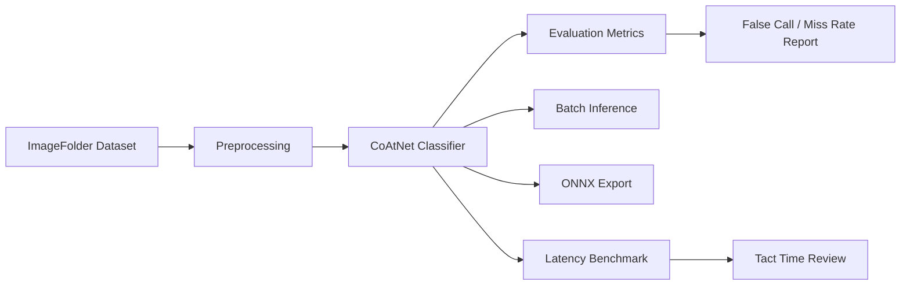

# System Design

## Scope

This repository demonstrates a production-style AOI inspection workflow using a
small public dataset. The same interfaces can be reused for semiconductor
inspection classes such as pass, scratch, contamination, chip crack, missing
component, or nozzle-related abnormality.

## Pipeline

## Engineering Decisions

- Configuration is loaded from YAML with validation instead of ad hoc text
  parsing.
- Training and inference are separate command-line workflows to match
  production operations.
- Evaluation reports AOI-oriented metrics instead of relying only on accuracy.
- Checkpoints and generated reports are treated as artifacts and excluded from
  Git.
- ONNX export is included so deployment can be tested outside PyTorch.

## Production Extension Points

- 8K tiling and tile-level aggregation before image-level judgement.
- Threshold calibration based on target false call rate and miss rate.
- Camera, lens, lighting, and recipe metadata attached to each inference run.
- Data drift reports for new production lots.
- ONNX Runtime or vendor SDK integration for line-side deployment.
